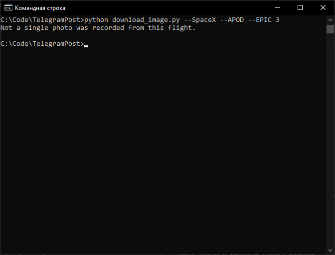
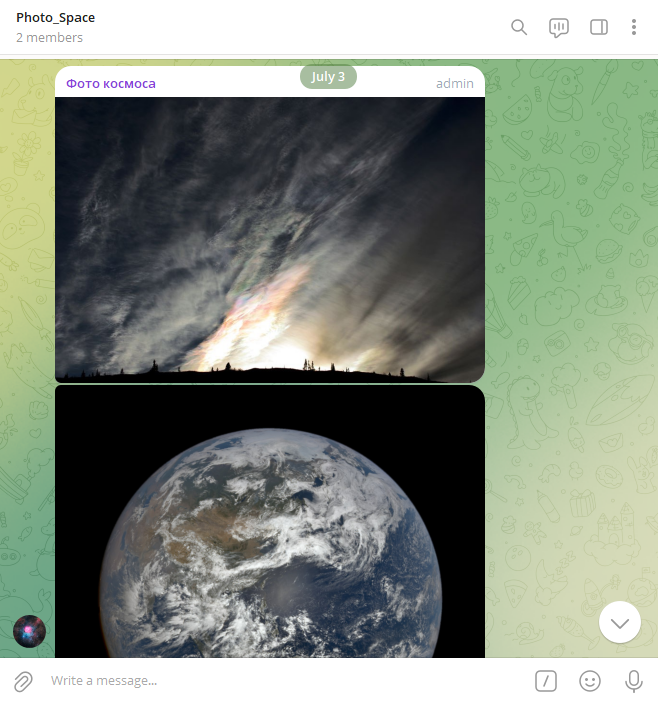

# Скачивание IMG и публикация постов в Телеграм канал с помощью API

## Скачивание IMG с помощью API SpaceX, NASA

Скачивает фотографии с репозитория [SpaceX REST API](https://github.com/r-spacex/SpaceX-API?tab=readme-ov-file) и официального сайта [NASA Open APIs](https://api.nasa.gov/) в папку ``` images ```

### Где брать ключи и куда их класть

Для фотографий SpaceX, API берётся из репозитория приведённого выше, ниже приведён пример получения ссылок на фото последнего полёта. Здесь нам важны ключи ``` flickr ``` и ``` original ```, в них лежат ссылки на фото которые нам нужны.


Для работы с API NASA, есть 2 варианта:
1. Использовать токен ``` DEMO_KEY ``` - при использовании данного метода, у вас будет ограниченное количество запросов
2. Пройти небольшую регистрацию на официальном сайте NASA, после регестрации токен придёт к вам на почту. Данный токен вы разместите в файле ``` .env ```


## Публикация постов в Телеграм канал с помощью API

Публикует фотографии космоса из заданной директории, в Телеграм канал 

### Где брать ключи и куда их класть

Для работы данного модуля вам понадобится:
1. Токен созданного вами Телеграм бота


2. ID созданного вами чата, где вы будете размещать фото


Их вы заносите в файл ``` .env ```

## Как установить

Python3 должен быть уже установлен. 
Затем используйте `pip` (или `pip3`, если есть конфликт с Python2) для установки зависимостей:
```
pip install -r requirements.txt
```

## Пример использования скриптов

Из командной строки, командой ``` python download_image.py {COUNT} {ID}``` запускаем скрипт загрузки фотографий



После завершения работы скрипта, у вас должна появиться папка с картинками космоса


После этого, в командной строке, командой ``` python telegram_bot.py {TIME} {DIRECTORY} ``` запускаем скрипт по публикации картинок


При правельном срабатывании скрипта, у вас в Telegram начнут публиковаться картинки космоса 

